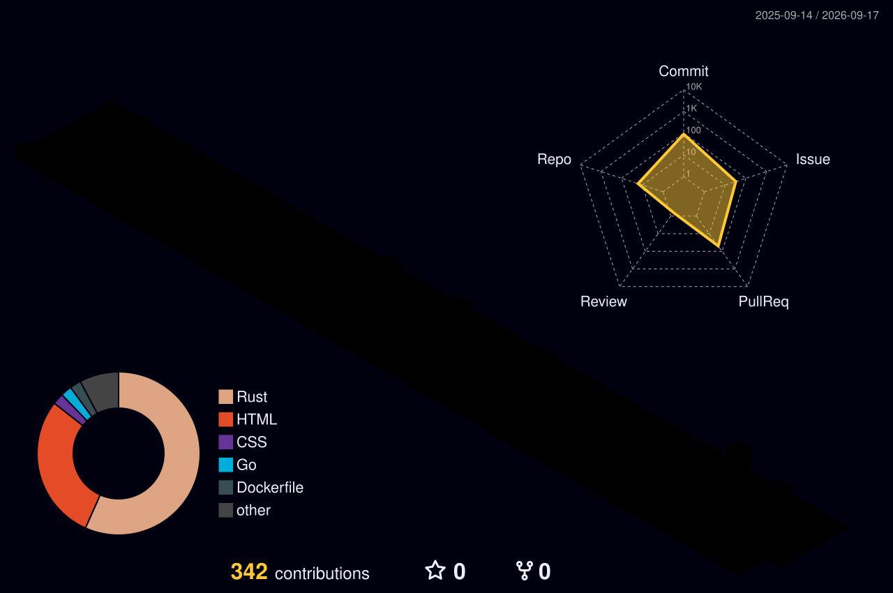

<div align="center">


<a href="https://github.com/isikawatatsuki">
  
</a>


</div>

## `> SYSTEM.IDENTITY`

```text
Developer based in Japan.
Turning ideas into maintainable software through code, automation, and AI.
```

- Building practical web applications
- Exploring AI-assisted development and automation
- Focused on readable code and maintainable systems

## `> ACTIVITY.MATRIX`

<div align="center">
  
</div>

## `> TELEMETRY`

<div align="center">
  
</div>

<div align="center">
  
  
</div>

<div align="center">
  
  
</div>

## `> TOOLCHAIN`

<div align="center">
  
</div>

## `> CURRENT.PROTOCOL`

```yaml
focus:
  - web_application_development
  - ai_assisted_workflows
  - developer_automation
principles:
  - readable
  - maintainable
  - useful
status: always_learning
```

<div align="center">


</div>
