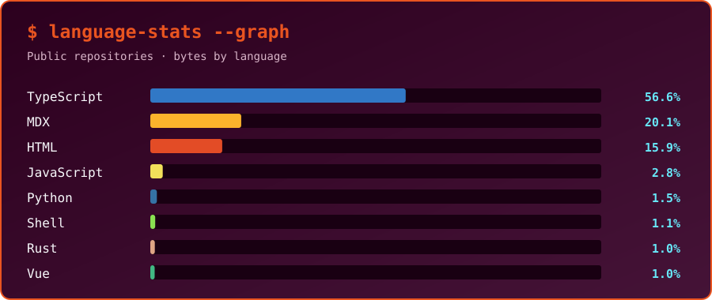
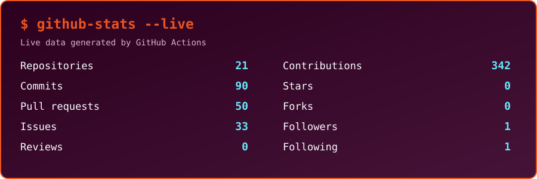

# `tatsuki@github:~$`

Web Developer · Osaka, Japan 
Web applications / AI-assisted development / Automation

---

## `$ neofetch`

<table>
  <tr>
    <td width="38%" align="center" valign="middle">
      
    </td>
    <td width="62%" valign="middle">
      <pre><code>tatsuki@github
-----------------------------
OS       Ubuntu GitHub Edition
Role     Web Developer
Location Osaka, Japan
Shell    zsh
Focus    Web Apps / AI / Automation
Status   Always learning</code></pre>
    </td>
  </tr>
</table>

---

## `$ ls ~/toolchain`

  

---

## `$ ./show-activity.sh`

  

---

## `$ language-stats --graph`

  

---

## `$ github-stats --live`

  

---

  

